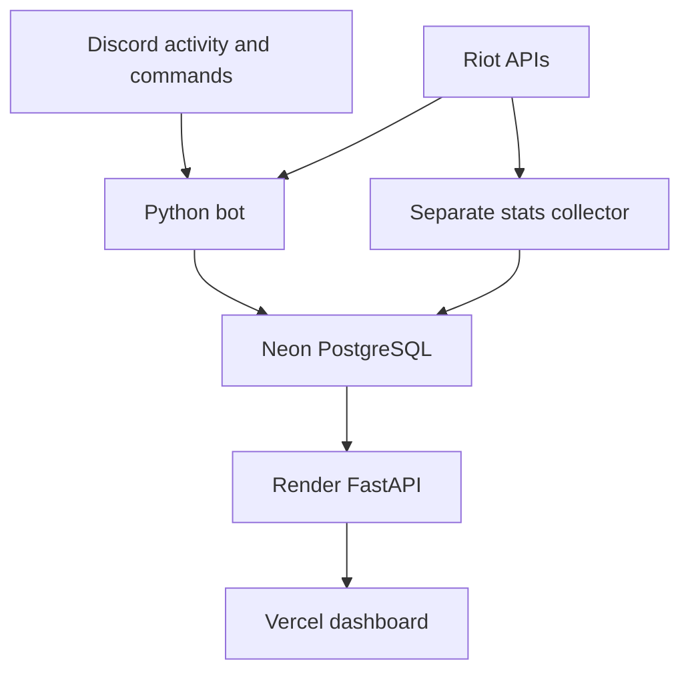

# LeagueMatch Discord Bot

LeagueMatch announces a linked player's active League of Legends match in a Discord server. Its companion [website](https://league-match-discord-bot.vercel.app/) displays aggregate ranked solo matchup statistics with sample sizes.

**Status:** The bot is in active development and currently runs with a Riot development key for private testing. The website and read-only statistics API are hosted; historical match collection is a separate script. A match score is planned, not implemented.

## Try LeagueMatch

The [bot overview](https://league-match-discord-bot.vercel.app/#about) explains the user flow. [Request bot test access](https://github.com/ReymondOH/LeagueMatch-Discord-Bot/issues/new) if you need an invitation. Do not post passwords, tokens, or private account identifiers in an issue.

1. A server admin adds the bot and allows it to view the chosen channel, send messages, and embed links.
2. A member with **Manage Server** permission uses `/setchannel` to select the notification channel.
3. A player runs `/link` with their Riot game name and tag line. No Riot password is required.
4. `/live` requests current match information. With `/tracking` enabled, the bot checks visible Discord activity every 60 seconds and posts a new match announcement when it detects League of Legends.
5. `/unlink` removes the account link in that server. It does not erase earlier announcements or previously collected historical data.

| Command | Purpose | Who can use it |
| --- | --- | --- |
| `/link game_name:... tag_line:...` | Link a Riot ID in this server | Member |
| `/live` | Check the linked player's active match | Linked member |
| `/tracking enabled:true` | Enable automatic announcements | Linked member |
| `/tracking enabled:false` | Disable automatic announcements | Linked member |
| `/unlink` | Remove this server's account link | Linked member |
| `/setchannel channel:#matches` | Choose an announcement channel | Manage Server |
| `/activity` | Check activity visible to the bot | Member; diagnostic |

## How the pieces fit



The bot stores linked accounts and guild settings. The collector saves ranked solo match observations in `match_stats`. FastAPI reads aggregate results without returning Discord IDs, Riot IDs, or participant PUUIDs. The dashboard filters by champion, role, and patch. It does not start the collector or call Riot directly.

## Project layout

```text
bot.py                    Discord bot and slash commands
database/database.py      PostgreSQL access and tables
services/riot_api.py      Riot API requests and champion metadata
services/match_tracker.py Automatic match checks
services/stats_collector.py Historical ranked solo collection
utils/embeds.py           Discord match embeds
web/                      React dashboard and FastAPI statistics service
render.yaml               Render API configuration
requirements.txt          Bot and collector dependencies
```

## Run the bot locally

Install Python and PostgreSQL, then clone the repository. In the repository root:

```powershell
git clone https://github.com/ReymondOH/LeagueMatch-Discord-Bot.git
cd LeagueMatch-Discord-Bot
py -m venv .venv
.\.venv\Scripts\python.exe -m pip install -r requirements.txt
```

Create a local `.env` file in the repository root:

```dotenv
DISCORD_TOKEN=your_discord_bot_token
RIOT_API_KEY=your_riot_api_key
DB_HOST=your_postgresql_hostname
DB_PORT=5432
DB_NAME=your_database_name
DB_USER=your_database_user
DB_PASSWORD=your_database_password
```

The bot reads the separate `DB_*` settings. Point them at your intended PostgreSQL database; for hosted Neon, use its connection details and enable TLS in the bot's `asyncpg` connections. Keep `.env`, database exports, tokens, and API keys out of Git. The website's `DATABASE_URL` setting belongs to **FastAPI on Render**, not to the current bot configuration.

In the [Discord Developer Portal](https://discord.com/developers/applications), enable the **Presence** and **Server Members** privileged intents. Install the bot in a server with the `bot` and `applications.commands` scopes and channel permissions to view, send messages, and embed links. The person running `/setchannel` needs Manage Server.

```powershell
.\.venv\Scripts\python.exe bot.py
```

The bot creates its tables when it starts. The PostgreSQL database and user must already exist.

## Collect historical matches

Run this **separately** from the repository root:

```powershell
.\.venv\Scripts\python.exe -m services.stats_collector
```

The current script samples five stored PUUIDs and requests up to ten recent match IDs for each. It stores eligible ranked solo observations; it is not triggered by `bot.py` and is not yet a scheduled job. To update the hosted dashboard, the collector must write to the Neon database that FastAPI reads. A Riot development key expires and is unsuitable for a continuously available public product.

## Website and deployment

- **Website:** [league-match-discord-bot.vercel.app](https://league-match-discord-bot.vercel.app/)
- **API health:** [leaguematch-stats-api.onrender.com/api/health](https://leaguematch-stats-api.onrender.com/api/health)
- **Website setup:** [web/README.md](web/README.md)
- **Deployment guide:** [web/DEPLOYMENT.md](web/DEPLOYMENT.md)
- **Privacy and Terms:** [Privacy](https://league-match-discord-bot.vercel.app/#privacy) · [Terms](https://league-match-discord-bot.vercel.app/#terms)

Vercel uses the public `VITE_API_BASE_URL` setting for the Render API. Render stores the private Neon `DATABASE_URL`, `DB_SSL=require`, and `DEMO_MODE=false`. The checked-in `render.yaml` may still contain an older CORS origin; verify `CORS_ORIGINS` matches the Vercel origin before deploying a Blueprint.

## Data and limitations

| Table | Contents |
| --- | --- |
| `linked_accounts` | Guild and Discord IDs, Riot ID and PUUID, platform, tracking preference, last announced game |
| `guild_settings` | Guild and announcement channel IDs |
| `match_stats` | Match ID, patch, champion and opponent, role, keystone, spells, outcome, participant PUUID |

The current bot stores the LAN platform (`la1`) for newly linked accounts. Match collection is limited to a sample of recent ranked solo games. Riot HTTP errors and rate limits need distinct handling before scaling. The proposed pre-match score needs review against Riot's game integrity policies before release. Historical data and Discord messages are not deleted automatically by `/unlink`; see the Privacy page for the current request process.

## Next steps

- Add Riot API rate-limit retries, error reporting, and caching where appropriate.
- Provide a private contact channel and operational deletion process.
- Expand and schedule collection after verifying Neon writes and production API access.
- Validate and document any score with sample sizes and policy review.

## Riot notice

LeagueMatch is not endorsed by Riot Games and does not reflect the views or opinions of Riot Games or anyone officially involved in producing or managing Riot Games properties. Riot Games and all associated properties are trademarks or registered trademarks of Riot Games, Inc.
