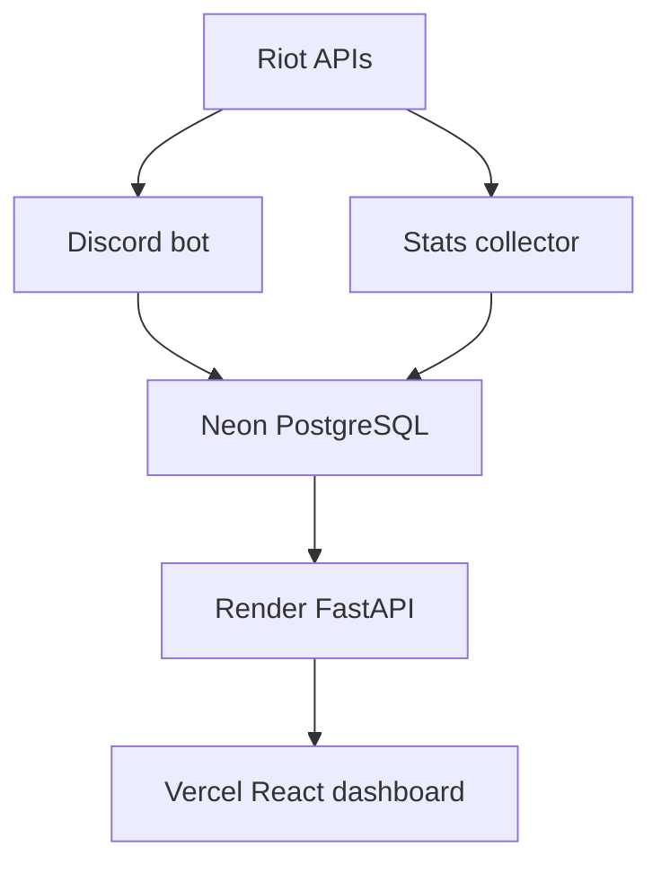

# LeagueMatch

LeagueMatch pairs a Discord bot that announces a linked player's active League of Legends match with a website for exploring collected ranked solo matchups. The dashboard shows sample sizes alongside win rates; it does not predict match outcomes.

**Website:** https://league-match-discord-bot.vercel.app/  
**API health:** https://leaguematch-stats-api.onrender.com/api/health  
**Bot access:** [Request test access](https://github.com/ReymondOH/LeagueMatch-Discord-Bot/issues/new). Do not post credentials or private account identifiers in an issue.

## Current features

- In a Discord server, `/link` associates a Discord member with a Riot ID; `/unlink` removes the link for that server.
- `/setchannel` lets a member with **Manage Server** permission choose the announcement channel. `/tracking` controls automatic announcements, `/live` checks the linked player's current game, and `/activity` checks the Discord activity visible to the bot.
- The bot checks linked members' visible activity before asking Riot for a current game, then avoids announcing the same game twice to that link.
- A separate collector saves ranked solo match observations to PostgreSQL. FastAPI returns aggregate statistics; the React dashboard filters them by champion, role, and patch. The public API does not return Discord IDs, Riot IDs, or PUUIDs.

The collector is **separate from the bot**. Starting the bot does not collect historical matches. Its current run samples five players and requests up to ten recent matches per player. The match-score feature is planned, not implemented.

## Architecture



## Try the bot

1. Request test access using the link above. A server admin adds the bot and allows it to view the selected channel, send messages, and embed links.
2. Run `/link` with your Riot game name and tag line. Never give the bot your Riot password.
3. A member with Manage Server permission runs `/setchannel` to select a text channel.
4. Run `/live` while in a match. For automatic announcements, enable `/tracking` and make sure Discord shows League of Legends as your activity. Use `/activity` to check what the bot detects.
5. Disable notifications with `/tracking enabled:false`, or remove the link in that server with `/unlink`. Earlier announcements and collected history are not automatically erased.

The dashboard can be explored without linking a Discord account. A direct bot invite is not published; the maintainer currently arranges access.

## Run the website locally

This README belongs in `web/` in the combined bot repository. Run commands from the folder containing `package.json`; there is no `frontend/` folder.

```powershell
npm install
Copy-Item .env.example .env
npm run dev
```

With `VITE_API_BASE_URL` blank, the site shows explicitly labeled demo data. To use the deployed API, set `VITE_API_BASE_URL=https://leaguematch-stats-api.onrender.com/api` in `web/.env` and restart Vite. This variable is public: never place a database password, Riot key, or Discord token in a `VITE_*` variable. Run `npm run build` to type-check and produce `dist/`.

## Run FastAPI locally

From `web/` on Windows:

```powershell
py -m venv .venv
.\.venv\Scripts\python.exe -m pip install -r backend/requirements.txt
Copy-Item backend/.env.example backend/.env
cd backend
..\.venv\Scripts\python.exe -m uvicorn app.main:app --reload --port 8000
```

The example configuration starts in demo mode. To read PostgreSQL, set `DEMO_MODE=false`, supply `DATABASE_URL` or the separate `DB_*` settings in `backend/.env`, and set `DB_SSL=require` for Neon. Set `CORS_ORIGINS` to the exact frontend origin. Check `/api/health` for `source: database` and `/api/stats` for real aggregates. The API needs only SELECT access to `match_stats`.

From the **combined repository root**, run the collector explicitly with `python -m services.stats_collector`. Its database settings must point to the same database as FastAPI for new results to appear on the website. Do not commit `.env` files or database backups.

## API

| Endpoint | Purpose |
| --- | --- |
| `GET /api/health` | Reports demo or database connectivity |
| `GET /api/stats` | Returns aggregate matchups, totals, and filter options |

`/api/stats` accepts optional `champion_id`, `role`, `patch`, `page`, and `page_size` (1–50). `matches` counts distinct match IDs; `observations` counts stored participant observations. Win rates describe the collected sample. There is no public write endpoint.

## Deployment and Riot review

Vercel builds `web/`; Render hosts FastAPI; Neon stores PostgreSQL data. Vercel's `VITE_API_BASE_URL` points to the Render URL ending in `/api`. Render uses private `DATABASE_URL`, `DB_SSL=require`, `DEMO_MODE=false`, and `CORS_ORIGINS` set to the Vercel origin. The checked-in `render.yaml` contains an older CORS origin; update it or the Render setting before redeploying from the Blueprint. See [DEPLOYMENT.md](DEPLOYMENT.md).

Before submitting to Riot, verify the published [Terms](https://league-match-discord-bot.vercel.app/#terms) and [Privacy](https://league-match-discord-bot.vercel.app/#privacy) pages, arrange bot access for reviewers, and test the commands and dashboard end to end. A short recording can demonstrate the Discord flow. The website's contact path currently uses a public GitHub issue to begin a private deletion request; define a private channel and deletion process before representing that flow as complete.

## Next steps

- Handle Riot rate limits, expired keys, and transient API errors distinctly.
- Define a private contact and deletion process for stored account data.
- Improve collector coverage and scheduling after testing writes to Neon and Riot key limits.
- Assess any proposed match score against Riot's game integrity rules.

## Riot notice

LeagueMatch is not endorsed by Riot Games and does not reflect the views or opinions of Riot Games or anyone officially involved in producing or managing Riot Games properties. Riot Games and all associated properties are trademarks or registered trademarks of Riot Games, Inc.
