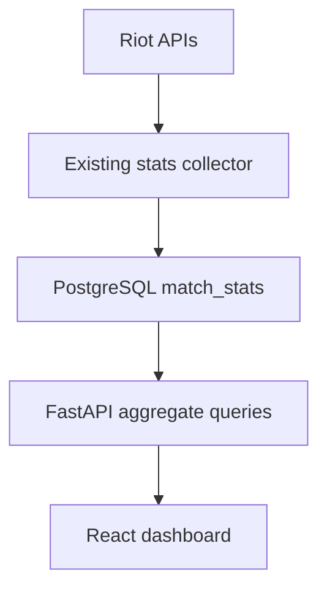

# LeagueMatch Web

A React + TypeScript dashboard for the LeagueMatch Discord bot. Players can explore historical champion matchups by champion, role, and patch. A separate Python FastAPI service reads aggregate statistics from the bot's PostgreSQL `match_stats` table.

## What is implemented

- React components for matchup exploration, bot documentation, and data/privacy information.
- Champion, role, and patch filters; win rates with observation counts; deterministic pagination.
- Loading, connection-error, empty-result, and explicit demo states.
- FastAPI endpoints with input validation, bounded pagination, connection pooling, and read-only SQL transactions.
- No participant identifiers are returned by the dashboard API.
- Existing Discord bot remains separate: account linking, notifications, and Riot API collection still run there.

**Deployment status:** The hosted frontend uses clearly labeled synthetic data until `VITE_API_BASE_URL` is configured and the Python service is separately deployed. The existing Site hosts the built React assets; it does not run Python or reach your computer's PostgreSQL server. The Site's audience remains private.

## Stack

| Layer | Technology |
| --- | --- |
| Interface | React, TypeScript, Vite, CSS, Lucide icons |
| HTTP API | Python, FastAPI, Uvicorn, Pydantic |
| Database access | asyncpg, PostgreSQL |
| Existing bot | Python, discord.py, Riot APIs |



The website does not need a Riot API key. It reads data already collected by the bot. Secrets stay in the Python services' environment variables.

## 1. Run the React website

Install Node.js 22.12+ and Python 3.12+ if you also want the backend. Open a terminal in **the folder containing this README and package.json**. There is no `frontend` subfolder.

```powershell
npm install
npm run dev
```

Open the Local URL printed in the terminal (normally `http://localhost:5173`). The website immediately works using its bundled synthetic dataset. You do not install React separately; `npm install` installs the declared dependencies.

```powershell
npm run typecheck
npm run build
```

`npm run build` writes the production frontend to `dist/`.

## 2. Run FastAPI locally

In a second terminal, in the same project folder, on Windows:

```powershell
py -m venv .venv
.\.venv\Scripts\python.exe -m pip install -r backend/requirements.txt
Copy-Item backend/.env.example backend/.env
cd backend
..\.venv\Scripts\python.exe -m uvicorn app.main:app --reload --port 8000
```

On macOS/Linux:

```bash
python3 -m venv .venv
.venv/bin/python -m pip install -r backend/requirements.txt
cp backend/.env.example backend/.env
cd backend
../.venv/bin/python -m uvicorn app.main:app --reload --port 8000
```

Visit `http://localhost:8000/docs` for interactive API documentation. By default the API uses the same demo records as React, so no database is required for this first run.

In the project root, copy `.env.example` to `.env` and set:

```dotenv
VITE_API_BASE_URL=/api
```

Restart `npm run dev`. Vite proxies `/api` to FastAPI on port 8000. The dataset banner still identifies demo responses as demo, even when they arrive through the API.

## 3. Connect your collector's real PostgreSQL database

Edit `backend/.env`:

```dotenv
DEMO_MODE=false
DB_HOST=localhost
DB_PORT=5432
DB_NAME=your_existing_bot_database
DB_USER=your_database_user
DB_PASSWORD=your_database_password
DB_SSL=disable
CORS_ORIGINS=http://localhost:5173,http://127.0.0.1:5173
```

Restart FastAPI. `/api/health` should report `source: database`. An empty collector table produces an empty dashboard; the API never replaces database errors with fake results.

The service needs SELECT permission on `match_stats`. Prefer a dedicated read-only database user for a hosted API. The API does not automatically create tables or change existing data. `backend/sql/schema.sql` is an optional compatible setup script; inspect it and run it yourself in pgAdmin or psql if needed. It preserves existing rows.

### Existing bot schema issue

The uploaded `database/database.py` has a missing comma after `puuid VARCHAR(100) NOT NULL` in one table definition. Add the comma before `UNIQUE(match_id, champion_id)`. Another older table definition lacks `puuid`; the optional SQL adds that column if missing. This project does not overwrite your bot files.

The current bot deduplicates on `(match_id, champion_id)`. The API reads the same schema. It only displays rows with standard Summoner's Rift roles. It assumes the collector's existing `queue_id == 420` restriction has been applied, because queue ID is not stored in this table.

## API contract

| Method | Endpoint | Purpose |
| --- | --- | --- |
| GET | `/api/health` | Database connectivity or explicit demo status |
| GET | `/api/stats` | Filtered totals, matchup rows, and filter options |
| GET | `/docs` | Generated OpenAPI documentation |

Example:

```text
/api/stats?champion_id=22&role=BOTTOM&patch=16.18&page=1&page_size=8
```

Filters are optional. Allowed roles: `TOP`, `JUNGLE`, `MIDDLE`, `BOTTOM`, `UTILITY`. Page size is 1–50. All values are SQL parameters. No route accepts an arbitrary SQL query or writes to the database.

`matches` counts distinct match IDs; `observations` counts participant records; `matchups` counts champion/opponent/role groups. Win rate is wins divided by observations for a group, rounded to one decimal. Matchups sort by observation count, then champion, opponent, and role. Filters apply before counting and pagination. Results are descriptive of the collected sample, not population estimates or predictions. No player profiles are exposed without an authentication and consent design.

## Hosting the complete stack

A root-level `render.yaml` is included for the combined repository.

1. Run the Python service on a Python-capable host with network access to PostgreSQL. A Dockerfile is included: `docker build -f backend/Dockerfile -t leaguematch-api .` from the project root.
2. Set backend environment variables through that host's secret settings. Set `DEMO_MODE=false`. Use TLS for a remote database as required by your provider (`DB_SSL=require` or `verify-full`). A `DATABASE_URL` can replace the separate DB settings.
3. Set `CORS_ORIGINS` to the exact website origin. It is a comma-separated list; there is no wildcard default.
4. Set frontend `VITE_API_BASE_URL=https://YOUR-API-HOST/api` and rebuild the frontend. This value is public. Never put database passwords, Discord tokens, or Riot API keys in `VITE_*` variables.
5. Configure the API host's request limits, HTTPS, and monitoring before public traffic. Add caching when usage warrants it; this initial implementation queries on demand.
6. Set the Site's audience to public when ready for Riot to review it. Keep example data labeled and describe planned features honestly.

The Python service is included as source but is not deployed by the Sites frontend publishing workflow. If the database was unavailable at startup, correct the configuration and restart the API process.

## Tests

From the project root on macOS/Linux:

```bash
.venv/bin/python -m pip install -r backend/requirements-dev.txt
cd backend
../.venv/bin/python -m pytest -q
```

On Windows, use `.\.venv\Scripts\python.exe` for installation, and `..\.venv\Scripts\python.exe -m pytest -q` from `backend`.

Tests cover filtering, aggregate arithmetic, pagination, invalid inputs, absence of private identifiers, explicit connection failures, and CORS. A real connection to your PostgreSQL instance must be verified on your machine.

## Project structure

```text
src/
  App.tsx                 Navigation and shared layout
  components/             Dashboard, About, Privacy, Brand
  api.ts                  Typed API client and explicit demo adapter
  types.ts                API response types
  data/                   Synthetic fixtures and champion display names
  styles.css              Responsive styling
backend/
  app/main.py             FastAPI app and validated endpoints
  app/models.py           Response schemas
  app/repository.py       Parameterized aggregate queries
  sql/schema.sql          Optional collector-compatible table setup
  tests/test_api.py        API behavior tests
  Dockerfile              Separate Python deployment
```

## Roadmap

- Rune and summoner-spell breakdowns with sample sizes.
- Collector reliability, migrations, and integration tests against PostgreSQL.
- Authentication and explicit consent before any personal player dashboard.
- An explainable post-match score, subject to Riot's applicable policies. No score is implemented yet.

## Attribution

LeagueMatch is not endorsed by Riot Games and does not reflect the views or opinions of Riot Games or anyone officially involved in producing or managing Riot Games properties. Riot Games and all associated properties are trademarks or registered trademarks of Riot Games, Inc.
